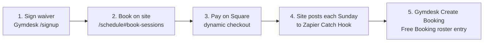
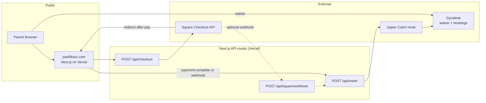

# Pasifika S&C — Technical Handoff

**Site:** [https://pasifikasc.com](https://pasifikasc.com)  
**Repo:** [https://github.com/UHE4VY/pasifika-sc](https://github.com/UHE4VY/pasifika-sc)  
**Last major deploy:** `f56a28d` — *Add dynamic Square checkout and automatic Gymdesk rostering after payment.*  
**Updated:** August 2026

---

## 1. Architecture

### Parent booking flow



**Step by step (what a parent does today)**

1. **Waiver** — Sign in Gymdesk at [pasifika-strength-conditioning.gymdesk.com/signup](https://pasifika-strength-conditioning.gymdesk.com/signup). Add siblings as family members so each athlete has their own signed waiver.
2. **Schedule** — On [pasifikasc.com/schedule#book-sessions](https://pasifikasc.com/schedule#book-sessions), pick class (Middle School or High School), plan (drop-in or monthly), Sundays, athlete name, and parent email.
3. **Square** — Click **Pay on Square**. The server creates a payment link with the correct total (`$45 × N` drop-ins or `$150` monthly for 4 Sundays).
4. **Zapier** — After payment, the site POSTs one JSON payload per selected Sunday to `GYMDESK_ROSTER_WEBHOOK_URL` (Zapier Catch Hook).
5. **Gymdesk bookings** — Zapier runs **Gymdesk → Create Booking** for each date. Staff see athletes under **Gym → Bookings** (not Members → Rosters).

### System diagram



**Auto-roster trigger:** Rostering runs whenever booking details are present and `GYMDESK_ROSTER_WEBHOOK_URL` is set — on `/schedule/payment-complete` after Square redirects back, and (if configured) again from `POST /api/square/webhook` when Square sends a payment event. Both paths can fire for the same payment; each webhook payload includes an `idempotencyKey` (`orderId:date`) so Zapier can dedupe. The Square webhook is a backup when a parent closes the browser before the redirect finishes.

---

## 2. Tech stack

| Layer | Technology |
|---|---|
| Framework | **Next.js 16** (App Router) |
| UI | **React 19**, **TypeScript** |
| Styling | Inline React styles + `app/globals.css` |
| Hosting | **Vercel** (auto-deploy from GitHub `main`) |
| Version control | **GitHub** — `UHE4VY/pasifika-sc` |
| Payments | **Square Checkout API** (`CreatePaymentLink`) |
| Gym operations | **Gymdesk** |
| Automation | **Zapier** (Webhooks by Zapier → Gymdesk Create Booking) |

This is **not Vue** and **not front-end-only**. Secrets stay on the server in Next.js API routes — there is no separate backend service.

---

## 3. Backend vs front end

| Front end (browser) | Server (Vercel — secrets never exposed) |
|---|---|
| `/schedule` booking UI | `POST /api/checkout` — validate dates/pricing, create Square payment link |
| `components/ScheduleBooking.tsx` | `POST /api/roster` — send booking events to Zapier webhook |
| `/waiver` — links to Gymdesk signup | `POST /api/square/webhook` — optional Square payment webhook → roster |
| Marketing pages (home, services, contact) | `lib/square/client.ts`, `lib/checkout/pricing.ts`, `lib/gymdesk/roster.ts` |
| `/schedule/payment-complete` — post-pay summary + roster trigger | `lib/roster/payload.ts` — webhook payload shape for Zapier |

### Key files

| File | Role |
|---|---|
| `content/gymdesk.ts` | Gymdesk URLs, session IDs, pricing, class schedule dates |
| `content/schoolYearGroupClasses.ts` | School-year class copy, venue, pricing display |
| `components/ScheduleBooking.tsx` | Main booking form (class, dates, pay button) |
| `app/api/checkout/route.ts` | Creates dynamic Square checkout |
| `app/schedule/payment-complete/page.tsx` | Post-payment page; triggers roster if configured |
| `lib/checkout/pricing.ts` | Server-side validation and line-item totals |
| `lib/roster/payload.ts` | Builds Zapier/Gymdesk webhook JSON per Sunday |
| `lib/gymdesk/roster.ts` | POSTs each event to Zapier Catch Hook |
| `app/api/square/webhook/route.ts` | Optional Square payment webhook handler |
| `scripts/list-square-locations.mjs` | Helper to list Square location IDs |

---

## 4. Production environment variables (Vercel)

Set all of these for **Production**. Mark tokens as **Secret**.

| Variable | Value / purpose |
|---|---|
| `NEXT_PUBLIC_SITE_URL` | `https://pasifikasc.com` — used for Square redirect URL |
| `SQUARE_ACCESS_TOKEN` | Production Square API access token (Developer Dashboard → Credentials → Production) |
| `SQUARE_LOCATION_ID` | `7F72YSACV3AYT` (Square location name: **PSC GYM**) |
| `SQUARE_ENVIRONMENT` | `production` |
| `GYMDESK_ROSTER_WEBHOOK_URL` | Zapier Catch Hook URL only — value must be `https://hooks.zapier.com/hooks/catch/...` (do **not** paste `GYMDESK_ROSTER_WEBHOOK_URL=` into the value field) |

**Optional (recommended for reliability):**

| Variable | Purpose |
|---|---|
| `SQUARE_WEBHOOK_SIGNATURE_KEY` | Enables `POST /api/square/webhook` so rostering works even if the parent never lands on payment-complete. Register webhook URL in Square Developer Dashboard: `https://pasifikasc.com/api/square/webhook` |

**Local development:** Copy values into `.env.local` (gitignored). Use sandbox token + `SQUARE_ENVIRONMENT=sandbox` for test payments without real charges.

After changing env vars in Vercel, **Redeploy** the project for changes to take effect.

---

## 5. Gymdesk + Square configuration

### Gymdesk

| Item | Value |
|---|---|
| Origin | `https://pasifika-strength-conditioning.gymdesk.com` |
| Gym ID | `23528` |
| Waiver / signup | `/signup` |
| Login | `/` (root) |
| Legacy public book page | `/book` — not required for the main site flow |
| **Middle School** session ID | `1774027` (schedule ID `36061`) |
| **High School** session ID | `1774028` (schedule ID `36062`) |
| MS times | Coed · 4:00–5:30 PM |
| HS times | Girls only · 5:30–7:00 PM |
| Series | Sundays Sep 6 – Dec 6, 2026 (14 sessions) |
| Cancelled dates | Nov 1 and Nov 29, 2026 (synced in `content/gymdesk.ts`) |
| Venue | Maximum Fitness & Performance, 1700 Industrial Rd STE C, San Carlos CA |

### Pricing

| Plan | Price | Notes |
|---|---|---|
| Drop-in | **$45** per Sunday | Total = `$45 ×` number of dates selected |
| Monthly | **$150** for 4 Sundays | Must select exactly 4 dates in the chosen month |
| Sibling discount | 15% (marketing copy) | **Not yet automated in Square checkout** — apply manually or add coupon support later |

### Free Booking (critical Gymdesk setting)

Payment happens **only on Square** via the website. Gymdesk booking options for both class series must be set to **Free Booking** so parents are not charged twice.

In Gymdesk manager:

1. **Schedule** → edit Middle School and High School series  
2. **Booking** tab → for each option (Drop-In, Monthly, etc.)  
3. Set **Fee** to **Free Booking**, keep capacity at **15**  
4. Save on the **recurring series**, not just a single date  

If this is missed, Gymdesk will still show a card-payment step after the site already collected on Square.

### Square

| Item | Value |
|---|---|
| Location ID (production) | `7F72YSACV3AYT` (**PSC GYM**) |
| API | Square Online Checkout — `POST /v2/online-checkout/payment-links` |
| API version header | `2024-11-20` |
| Checkout totals | Calculated server-side in `lib/checkout/pricing.ts` (not editable in browser) |
| Payment note | Encoded roster metadata (`PSC1:{...}`) for optional webhook parsing |

Legacy static Square payment links still exist in `content/gymdesk.ts` but are **deprecated** — the live flow uses dynamic checkout via `/api/checkout`.

---

## 6. Zapier mapping requirements

**Zap structure:** Webhooks by Zapier (Catch Hook) → Gymdesk (Create Booking)

The site sends **one POST per selected Sunday**. Map fields from the Catch Hook payload — use the webhook field pills, not typed placeholder names.

| Gymdesk Create Booking field | Webhook field | Example |
|---|---|---|
| Session ID | `sessionId` or `event_id` | `1774027` (MS) / `1774028` (HS) |
| Date | `date` | `2026-09-06` (ISO) or `date_us` (`09/06/2026`) |
| Name | `name` or `athleteName` | Athlete full name |
| Email | `email` | Parent email used at checkout |
| Start time | `start` or `startTime` | `4:00 PM` / `5:30 PM` |
| Disable Multiple Pricing | `disabled_multiple_pricing` | **Yes** / `true` |
| Notes | `notes` | Auto-filled (Square payment reference) |
| Dedupe key (optional) | `idempotencyKey` | e.g. `abc-123:2026-09-06` — use in Zapier “Only continue if…” or Storage dedupe |

**Common failure modes (from testing):**

- Wrong Gymdesk account connected in Zapier (must be **Pasifika Strength & Conditioning**, not a sandbox gym)
- Typed field names instead of Catch Hook pills → Zap “succeeds” but creates nothing visible
- Multiple Pricing left enabled on Free Booking classes → Gymdesk Create Booking errors
- Staff looking in **Members → Rosters** instead of **Gym → Bookings**

**Sample webhook payload** (one Sunday):

```json
{
  "name": "Jane Athlete",
  "email": "parent@example.com",
  "event_id": 1774027,
  "date": "2026-09-06",
  "date_us": "09/06/2026",
  "start": "4:00 PM",
  "notes": "Paid on Square (website checkout) · drop-in",
  "disabled_multiple_pricing": true,
  "idempotencyKey": "abc-123:2026-09-06",
  "sessionId": "1774027",
  "scheduleId": "36061",
  "sessionTitle": "Middle School (Coed)",
  "classId": "middle-school",
  "plan": "drop-in"
}
```

---

## 7. What's working vs fragile

| Working | Fragile / ops-heavy |
|---|---|
| Consolidated parent flow: waiver → schedule → Square → auto-roster | Four-system glue: Vercel + Square + Zapier + Gymdesk |
| Dynamic Square totals (`$45 × N` or `$150` monthly) | Zapier field mapping must be exact; wrong mapping = silent or confusing failures |
| Server-side price validation (amounts not tamperable in browser) | Staff must check **Gym → Bookings**, not **Members → Rosters** |
| GitHub → Vercel auto-deploy from `main` | Waiver is honor-system checkbox on site (not hard-gated before pay) |
| Gymdesk Free Booking + Square payment split (when configured) | Sibling discount advertised but not in checkout API yet |
| Zapier → Gymdesk Create Booking proven with test pings | Parent must use same email in checkout as Gymdesk registration for matching |
| Production env vars documented and deployable | If parent closes browser before redirect, roster depends on Square webhook being configured |

---

## 8. Priorities / timeline

No hard external deadline is documented. Priority throughout build has been **parent-facing booking live first, polish second**.

| Status | Item |
|---|---|
| **Shipped** | Consolidated CTAs; dynamic Square checkout; production Vercel env vars; Zapier → Gymdesk path validated in testing |
| **ASAP (ops)** | End-to-end live smoke test: open Square from production site → verify amount → complete payment → confirm booking appears in Gymdesk **Bookings** |
| **Nice-to-have** | Square Marketing coupons (`enable_coupon` in checkout API); `SQUARE_WEBHOOK_SIGNATURE_KEY` for redirect-proof rostering |
| **Future simplification** | Gymdesk-first book-and-pay (drop Zapier + custom checkout) if four-system maintenance cost is too high |
| **Cleanup** | Better parent error messages when Square or Zapier fails; document sibling discount handling |

---

## 9. Useful npm commands

```bash
npm run dev                    # Start local dev server (http://localhost:3000)
npm run build                  # Production build check
npm run start                  # Run production build locally
npm run lint                   # ESLint
npm run square:locations       # List Square location IDs (needs SQUARE_ACCESS_TOKEN in .env.local)
```

**Local checkout test:** Open `/schedule#book-sessions`, select dates, pay with Square sandbox test card `4111 1111 1111 1111`.

---

## 10. One-line summary for stakeholders

*Marketing site on Vercel (Next.js/React); parents sign waiver in Gymdesk, book and pay via dynamic Square checkout on the website, and Zapier automatically creates Gymdesk class bookings after payment — no second manual reserve step.*
